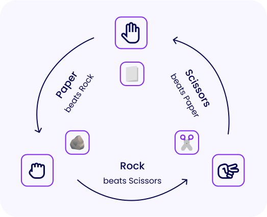

# shifumi-game

Shifumi (rock-paper-scissors) game in ReactJS

Rock-paper-scissors - this principle has actually been known for centuries under several different names (Shifumi, Jankenpon, Rochambeau, Roshambo). It offers a great value in any game, and many designs heavily rely on it. In fighting games for instance, hit, guard and grab inputs tend to share this relationship.

History:
The earliest form of Rock Paper Scissors was created in Japan and is called Janken. This is a variation of the Chinese games introduced in the 17th century. Janken uses the Rock, Paper and Scissors signs. It is the game that the modern version of Rock Paper Scissors derives from directly. Hand-games using gestures to represent the three conflicting elements of rock, paper and scissors have been most common since the modern version of the game was created in the late 19th Century. This was between the Edo and Meiji periods.

By the early 20th century, Rock Paper Scissors had spread beyond Asia, especially through increased Japanese contact with the West. Its English language name is therefore taken from a translation of the names of the three Japanese hand-gestures for rock, paper and scissors; elsewhere in Asia the open-palm gesture represents “cloth” rather than “paper”. The shape of the scissors is also adopted from the Japanese style.

Rock Paper Scissors is one of the few sansukumi-ken games still played in modern Japan. It’s uncertain why Rock Paper Scissors managed to surpass the popularity of all the other sansukumi-ken games. Everyone believes that the global success of rock paper scissors comes from the universal appeal of its simplicity. Unlike other sansukumi-ken games, rock paper scissors could be easily understood by any audience.

- Source: World Rock Paper Scissors Association

Rock-paper-scissors rules:

